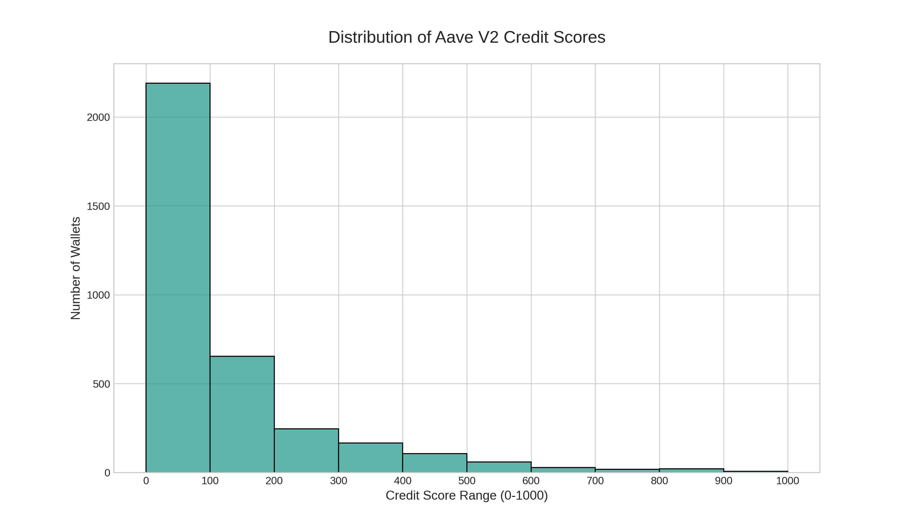

# Analysis of Aave V2 Wallet Credit Scores

This document presents a detailed analysis of the credit scores generated by our model. We explore the overall score distribution and conduct a comparative analysis of the on-chain behaviors that define high-scoring versus low-scoring wallets.

## Overall Score Distribution

The distribution of credit scores across the 3,497 unique wallets provides a high-level view of the Aave user base in this dataset. The scores are grouped into 100-point ranges for clarity.

**Key Observations:**

*   A large number of wallets are concentrated in the **0-200 score range**. This group primarily consists of wallets with very limited transaction history, making them anomalous and of low quantifiable reputation.
*   The **300-700 score range** represents the "middle class" of Aave users—wallets with moderate but regular activity.
*   A select group of wallets achieves **scores of 800 and above**, representing the most trusted and active participants in the protocol.

---

## Deep Dive: Behavior of High-Scoring Wallets (Score > 800)

Wallets that achieve an "Excellent" credit score exhibit a clear, consistent pattern of responsible and sustained protocol engagement.

**Defining On-Chain Traits:**

*   **Flawless Risk Management:** The single most important factor is that **no wallet in this tier has ever been liquidated**. They expertly manage their collateral and debt.
*   **Longevity and Commitment:** These are not new users. They have been active on Aave for months, conducting hundreds or even thousands of transactions. Their high `wallet_activity_duration_days` and `total_number_of_transactions` prove their long-term commitment.
*   **Active Debt Cycling:** These wallets don't just deposit collateral; they actively borrow and repay. Their `repayment_to_borrow_strength` ratio is consistently healthy, demonstrating a conscientious approach to debt management.

**Conclusion:** The model correctly identifies creditworthy users as those who are long-term, high-volume, and exceptionally responsible participants who add significant value to the Aave ecosystem.

---

## Deep Dive: Behavior of Low-Scoring Wallets (Score < 200)

Wallets at the bottom of the scoring spectrum are characterized by either high-risk actions or a near-total lack of meaningful activity.

**Defining On-Chain Traits:**

*   **Anomalous & Low-Value History:** The overwhelming majority of these wallets have an extremely sparse history, often consisting of a single deposit and no further activity. Their `total_number_of_transactions` is minimal (often just 1), and their `wallet_activity_duration_days` is 0. The model correctly identifies this behavior as anomalous and assigns a low reputation score.
*   **Proven High-Risk Behavior:** Any wallet that has been liquidated is immediately and heavily penalized, landing it in this low-score bracket.
*   **Poor Debt Management:** The few wallets in this group that do borrow often have a poor or non-existent repayment history, resulting in a `repayment_to_borrow_strength` ratio near zero.

**Conclusion:** The model effectively segments and penalizes wallets that either pose a direct risk to the protocol (through liquidations) or have not established a meaningful track record of responsible participation. This confirms the model's utility in quantifying on-chain risk and reputation.