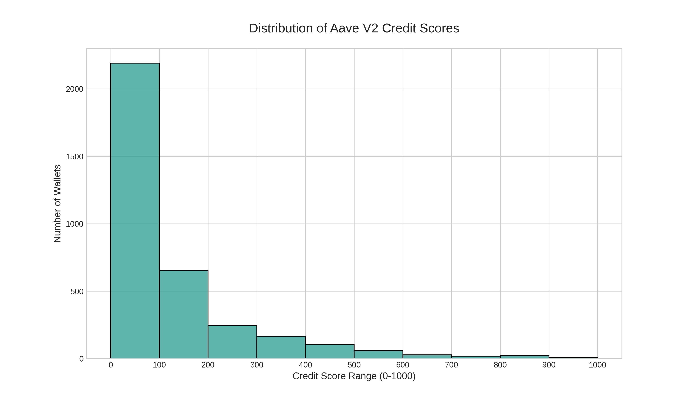

<h1 align="center" style="font-size: 3em;">💳 Aave V2 On-Chain Credit Scoring Engine</h1>

<p align="center" style="font-size: 1.2em;">
A machine learning pipeline to quantify on-chain reputation for wallets using the Aave V2 protocol.
<br>
Translates wallet behavior into <strong>0–1000 credit scores</strong> for capital-efficient DeFi.
</p>

<p align="center">
  <a href="#-how-to-run-this-project"></a>
  <a href="#-methodology-unsupervised-anomaly-detection"></a>
  <a href="#-project-documentation"></a>
</p>

---

<div align="center">
  
</div>

---

<h2 align="center">🏗️ Architecture Diagram</h2>

<div align="center">

<table width="90%" align="center">
  <tr>
    <td colspan="3" align="center">
      <strong>📂 Raw Input</strong><br>
      <code>user-transactions.json</code>
    </td>
  </tr>

  <tr>
    <td colspan="3" align="center">⬇️</td>
  </tr>

  <tr>
    <td colspan="3" align="center" bgcolor="#f6f8fa" style="border:1px solid #d0d7de; padding: 10px;">
      <strong>📓 credit_scorer_notebook.ipynb</strong><br>
      <em>One-stop ML pipeline for ingest, transform, score, visualize</em>
    </td>
  </tr>

  <tr>
    <td align="center">🧾 Ingest + Preprocess</td>
    <td align="center">🛠️ Feature Engineering</td>
    <td align="center">🤖 Model Inference</td>
  </tr>

  <tr>
    <td align="center">🔹 Normalize Logs<br>🔹 Structure into DataFrame</td>
    <td align="center">🔹 History Metrics<br>🔹 Risk Ratios<br>🔹 Activity Volume</td>
    <td align="center">🔹 Isolation Forest<br>🔹 Anomaly Scores → Credit Scores</td>
  </tr>

  <tr>
    <td colspan="3" align="center">⬇️</td>
  </tr>

  <tr>
    <td align="center" bgcolor="#e7f5ff" style="padding: 10px;">
      📄 <strong>wallet_credit_scores.csv</strong><br>
      Final credit scores
    </td>
    <td align="center" bgcolor="#e8f5e9" style="padding: 10px;">
      📊 <strong>score_distribution.png</strong><br>
      Score histogram
    </td>
    <td align="center" bgcolor="#fff3e0" style="padding: 10px;">
      📘 <strong>analysis.md</strong><br>
      Methodology & Results
    </td>
  </tr>
</table>

</div>

---

## ⚙️ Pipeline Overview

<div style="display: flex; flex-direction: column; align-items: center; justify-content: center;">

### 1️⃣ Data Ingestion
- Parse `user-transactions.json` into structured DataFrames.

### 2️⃣ Feature Engineering
- Derive 20+ features:
  - 🧾 Wallet Age & History
  - 💸 Deposit/Borrow Behavior
  - ⚠️ Risk Ratios (LTV, Repayment Strength)

### 3️⃣ ML-Based Scoring
- Apply **Isolation Forest** to detect behavioral outliers.
- Map anomaly score → credit score range of 0–1000.

### 4️⃣ Result Output
- 🗂️ `wallet_credit_scores.csv`
- 📊 `score_distribution.png`
- 📘 `analysis.md`

</div>

---

## 🧪 Sample Feature Categories

| 🧠 Category      | Features Included                                  |
|------------------|----------------------------------------------------|
| Wallet History   | Wallet age, first/last activity                    |
| Financial Volume | Total deposits, borrows, repayments                |
| Behavior Metrics | Frequency, avg txn size, borrow/deposit count     |
| Risk Ratios      | Loan-to-Value, Repayment-to-Borrow Strength        |

---

## 📤 Output Artifacts

- `wallet_credit_scores.csv` – Final scores per wallet
- `score_distribution.png` – Visual credit score distribution
- `analysis.md` – Feature analysis + insights

---

## 🧠 Methodology: Unsupervised Credit Risk Detection

### Why Isolation Forest?

- 🟢 **No labels needed**: Perfect for raw DeFi data
- ⚠️ **Risk = Anomaly**: Model identifies wallets that deviate from "normal" behavior
- 🚀 **Efficient**: Works well on thousands of wallet profiles

```text
Anomaly Score → Inverted → Scaled → 0 to 1000 Credit Score
